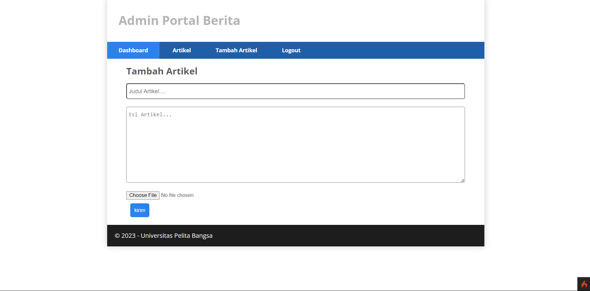
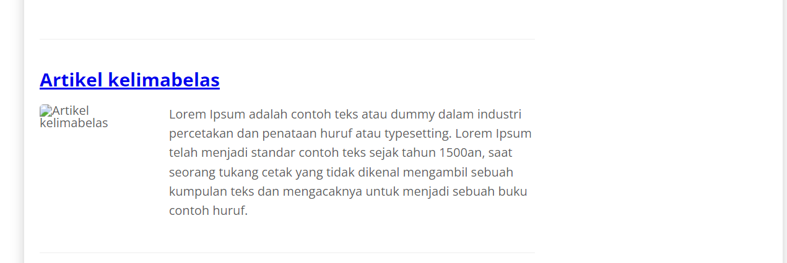

# 11 LAB WEB

# Langkah-langkah & Persiapan
## Upload Gambar Pada Artikel
- Untuk menambahkan fungsi unggah gambar pada artikel, Buka kembali Controller Artikel pada project sebelumnya, kemudian sesuaikan kode pada method add seperti berikut:

```php
    public function add()
    {
        $validation = \Config\Services::validation();
        $validation->setRules(['judul' => 'required']);
        $isDataValid = $validation->withRequest($this->request)->run();
        if ($isDataValid) {
            $file = $this->request->getFile('gambar');
            $file->move(ROOTPATH . 'public/gambar');
            $artikel = new ArtikelModel();
            $artikel->insert([
                'judul' => $this->request->getPost('judul'),
                'isi' => $this->request->getPost('isi'),
                'slug' => url_title($this->request->getPost('judul')),
                'gambar' => $file->getName(),
            ]);
            return redirect('admin/artikel');
        }
        $title = "Tambah Artikel";
        return view('artikel/form_add', compact('title'));
    }
```

- Kemudian pada file Views/artikel/form_add.php tambahkan field input file seperti berikut.

```php
    <p>
      <input type="file" name="gambar">
    </p>
```

- Dan sesuaikan tag form dengan menambahkan ecrypt type seperti berikut.

```php
<form action="" method="post" enctype="multipart/form-data">
```

- Uji coba upload dengan mengakses menu tambah artikel.



- Hasilnya akan seperti ini ketika gambar telah di upload.



# Terimakasih